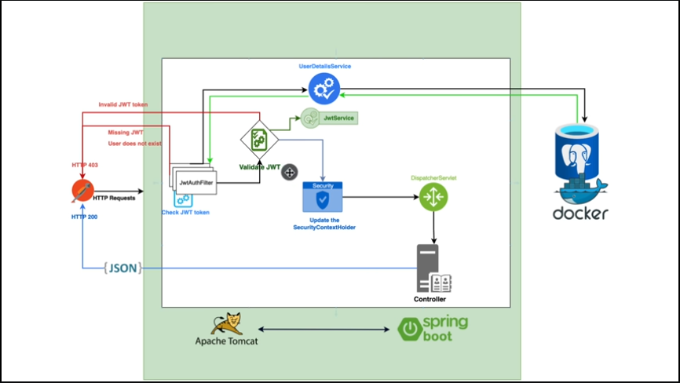

<h3> Login system </h3>
This is a login system done with spring security and JWT

It consists of authentication and registration for a **user class**

Project Breakdown

- Folder:
    - Files:
        - Overall Look:
            - specifics.
- user:
    - User:
        - User class for the registered user.
    - role:
        - Enumeration for the user role:
            - User.
            - Admin.
    - UserRepository:
        - Standard JpaRepository.
- config:
    - ApplicationConfig:
        - Configuration for the whole application:
    - JwtAuthenticationFilter:
        - Implemented filter checking for:
            - Jwt Validation.
            - Jwt followed by email Extraction.
            - Passing to next filter in filterChain.
    - JwtService:
        - Service methods that are pretty much self-explanatory.
- Auth:
    - Requests and responses.
    - AuthService:
        - Implements most methods used by the AuthController.
    - AuthController:
        - Contains the HHTP requests that can be done by the front end.

<h5> Spring Security Breakdown </h5>

When building a Spring Security app for registration and authentication using JWT, there are several key components and
concepts to keep in mind:

    UserDetailsService: This is a core interface in Spring Security that provides user-related data, such as usernames, passwords, and authorities. You can implement this interface to load user information from a database, file, or other source.

    PasswordEncoder: This is another core interface in Spring Security that provides password encoding functionality. You should use this interface to securely encode user passwords before storing them in a database.

    AuthenticationProvider: This interface defines the contract for an object that can authenticate a user based on their credentials. You can implement this interface to provide custom authentication logic, such as using JWT tokens.

    JwtService: This is a custom service that you can implement to handle JWT tokens. It typically includes methods for generating and validating JWT tokens, as well as extracting user information from a token.

    JwtAuthFilter: This is a custom filter that intercepts incoming HTTP requests and checks for JWT tokens in the Authorization header. If a token is present, it uses the JwtService to validate the token and authenticate the user.

    HttpSecurity: This is a key class in Spring Security that allows you to configure security-related aspects of your application, such as which URLs are protected, which authentication providers to use, and which filters to apply.

